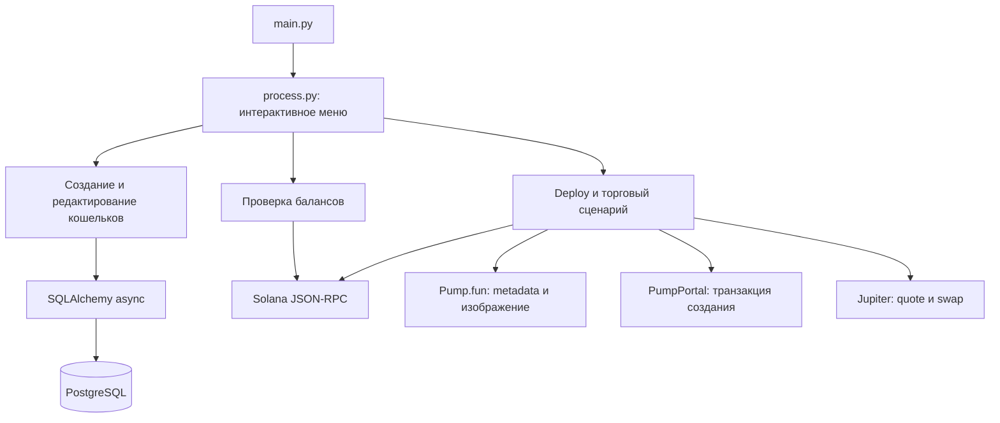

# MatShi-TokenDeployerV2

Интерактивная консольная утилита на Python для управления Solana-кошельками, проверки их балансов и подготовки сценария создания токена на Pump.fun.

## Overview

Приложение запускается как CLI и показывает меню для создания и редактирования кошельков, проверки SOL-балансов и запуска token deploy flow. Данные dev-кошельков и buyer-групп хранятся в PostgreSQL. Балансы и транзакции запрашиваются через настроенный Solana JSON-RPC endpoint.

Код deploy-модуля связывает Pump.fun metadata upload, PumpPortal для получения транзакции, Solana RPC для отправки транзакции и Jupiter API для последующих swap-операций. Реализацию этих операций следует считать незавершённой из-за ошибок, перечисленных ниже. HTTP API самого приложения в репозитории нет.

## Features

- Асинхронное интерактивное меню в терминале.
- Создание dev-кошелька; редактирование и удаление dev-кошельков и buyer-групп.
- Проверка SOL-баланса dev-кошелька или кошельков выбранной группы через Solana RPC.
- Реализованный в коде сценарий Pump.fun: выбор кошельков, генерация mint-адреса с суффиксом `pump`, ввод метаданных токена, загрузка изображения и отправка транзакции.
- Код массовых buy/sell swap-операций через Jupiter.
- Пункт Bonk.Fun присутствует в меню, но помечен в коде как недоступный.

## Tech Stack

| Область | Технологии |
|---|---|
| Язык и CLI | Python, `asyncio`, InquirerPy |
| Solana | `solders` для ключей и versioned transactions; Solana JSON-RPC |
| HTTP | `aiohttp`; Pump.fun/PumpPortal и Jupiter API |
| База данных | PostgreSQL, SQLAlchemy 2 async, `asyncpg` |
| Вспомогательные библиотеки | `base58`, `tabulate`, Loguru, `dotenv` (`load_dotenv`) |
| Зависимости | Закреплены в `requirements.txt` |

## Architecture



## Project Structure

```text
main.py                         # запуск CLI и настройка логирования
process.py                      # главное меню и диспетчер действий
interface/                      # меню и строки интерфейса
database/
  engine.py                     # подключение SQLAlchemy к PostgreSQL
  models.py                     # модели dev_wallets, buyer_groups, buyer_wallets
  create_tables.py              # создание таблиц через metadata.create_all
utils/
  walletscreator/               # создание кошельков и buyer-групп
  walletseditor/                # редактирование и удаление записей
  balancechecker/               # чтение SOL-балансов через RPC
  deployer/                     # Pump.fun deploy и Jupiter swaps
.env-example                    # пример конфигурации
requirements.txt                # закреплённые Python-зависимости
```

## Requirements / Prerequisites

- Python 3.10 или новее: исходники используют синтаксис типов `X | None`.
- Доступный PostgreSQL и заранее созданная база данных. Версия PostgreSQL в репозитории не закреплена.
- Сетевой доступ к указанному в конфигурации Solana RPC и внешним API, используемым выбранной функцией.
- Интерактивный терминал для меню InquirerPy.

Docker-конфигурации, CI workflow, миграции, отдельная конфигурация линтера/форматтера и тестовый набор в репозитории отсутствуют.

## Installation

Команды ниже выполняются из корня репозитория в Bash:

```bash
python3 -m venv .venv
source .venv/bin/activate
python -m pip install --upgrade pip
python -m pip install -r requirements.txt
cp .env-example .env
```

Откройте `.env` и замените шаблонные значения подключения к PostgreSQL на параметры уже созданной базы. Затем проверьте RPC и API URLs. Файл `.env` добавлен в `.gitignore`.

## Configuration

Приложение загружает настройки через `load_dotenv()` из `.env` и читает перечисленные ниже переменные:

| Variable | Required | Description | Default |
|---|---:|---|---|
| `DB_USER` | Да | Пользователь PostgreSQL | Шаблонное значение в `.env-example`; заменить |
| `DB_PASS` | Да | Пароль PostgreSQL | Шаблонное значение в `.env-example`; заменить |
| `DB_HOST` | Да | Хост PostgreSQL | Шаблонное значение в `.env-example`; заменить |
| `DB_PORT` | Да | Порт PostgreSQL | Шаблонное значение в `.env-example`; заменить на числовой порт |
| `DB_NAME` | Да | Имя заранее созданной базы данных | Шаблонное значение в `.env-example`; заменить |
| `RPC_URL` | Да | Solana JSON-RPC для проверки балансов и отправки транзакций | `https://api.mainnet-beta.solana.com` |
| `PUMP_URL` | Для Pump.fun deploy | PumpPortal endpoint для получения транзакции создания | `https://pumpportal.fun/api/trade-local` |
| `JUPITER_QUOTE_URL` | Для swap-сценария | Базовый URL Jupiter Quote API | `https://quote-api.jup.ag/v6/` |
| `JUPITER_SWAP_URL` | Для swap-сценария | Jupiter Swap API endpoint | `https://lite-api.jup.ag/swap/v1/swap` |
| `SOL_MINT` | Для swap-сценария | Mint wrapped SOL, используемый в swap-запросах | `So11111111111111111111111111111111111111112` |

Значения DB в `.env-example` — placeholders, а не готовые реквизиты. Пример `RPC_URL` указывает на Solana mainnet-beta; операции, отправленные через него, относятся к mainnet. Не помещайте реальные пароли или ключи в README и не коммитьте `.env`.

## Database

Приложение подключается к PostgreSQL через `postgresql+asyncpg` и использует таблицы:

- `dev_wallets` — имя, публичный и приватный ключ dev-кошелька;
- `buyer_groups` — группы buyer-кошельков;
- `buyer_wallets` — публичный и приватный ключи и порядковый номер кошелька в группе.

Создайте базу PostgreSQL отдельно, настройте DB-переменные в `.env`, затем создайте отсутствующие таблицы:

```bash
python -m database.create_tables
```

Скрипт использует SQLAlchemy `metadata.create_all`; Alembic или другая система миграций в репозитории не настроена. Скрипт создаёт таблицы, но не создаёт саму базу PostgreSQL.

## Running the Project

После настройки `.env` и таблиц запустите меню:

```bash
python main.py
```

Приложение работает как интерактивный CLI, а не как постоянно запущенный web server. Логи выводятся в терминал и записываются в `logs/app.log` с ротацией файла при достижении 10 MB и хранением до одного месяца.

## Development

Из корня репозитория доступны следующие команды:

```bash
python main.py
python -m database.create_tables
```

Первая запускает CLI, вторая создаёт таблицы в настроенной базе.

Ключи кошельков сохраняются в PostgreSQL в виде base58-строк без шифрования; экран редактирования также выводит приватные ключи. Учитывайте это при выборе базы и окружения.
